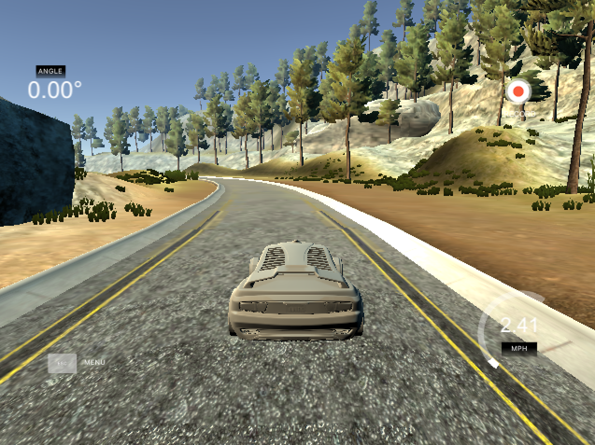
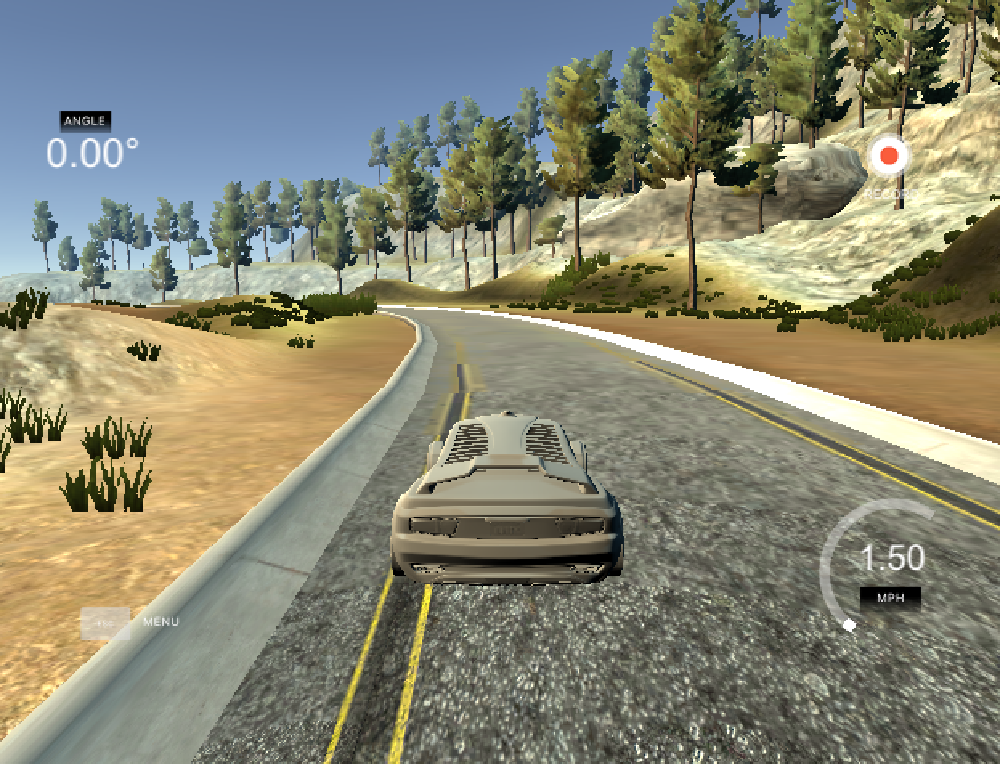
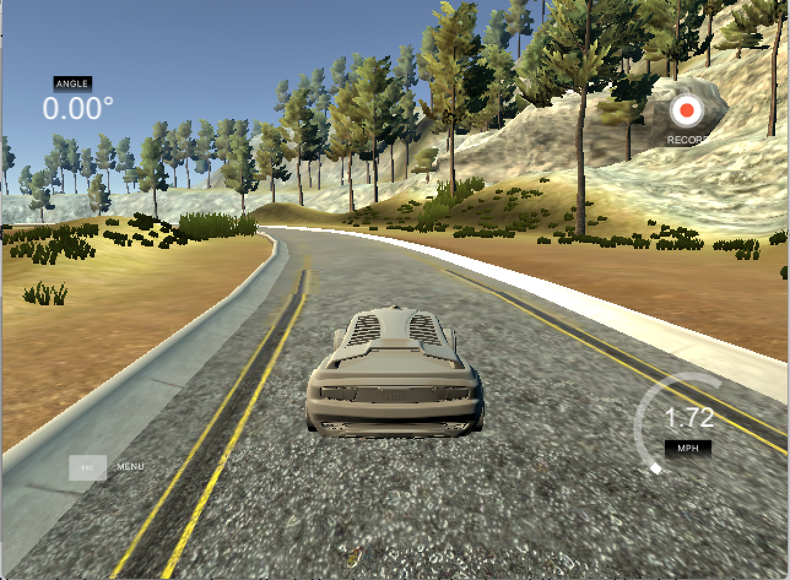
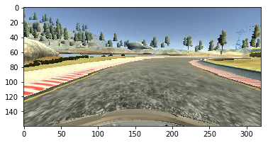
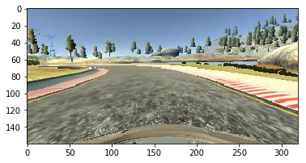
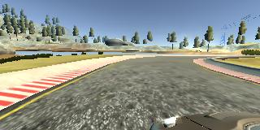
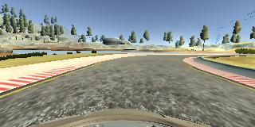
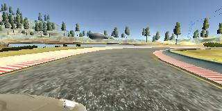

**Behavioral Cloning Project**

The goals / steps of this project are the following:
* Use the simulator to collect data of good driving behavior
* Build, a convolution neural network in Keras that predicts steering angles from images
* Train and validate the model with a training and validation set
* Test that the model successfully drives around track one without leaving the road
* Summarize the results with a written report


## Rubric Points
### Here I will consider the [rubric points](https://review.udacity.com/#!/rubrics/432/view) individually and describe how I addressed each point in my implementation.

---
### Files Submitted & Code Quality

#### 1. Submission includes all required files and can be used to run the simulator in autonomous mode

My project includes the following files:
* model.py containing the script to create and train the model
* drive.py for driving the car in autonomous mode
* model.h5 containing a trained convolution neural network
* writeup_report.md or writeup_report.pdf summarizing the results

#### 2. Submission includes functional code
Using the Udacity provided simulator and my drive.py file, the car can be driven autonomously around the track by executing
```sh
python drive.py model.h5
```

#### 3. Submission code is usable and readable

The model.py file contains the code for training and saving the convolution neural network. The file shows the pipeline I used for training and validating the model, and it contains comments to explain how the code works.

### Model Architecture and Training Strategy

#### 1. An appropriate model architecture has been employed

My model consists of a convolution neural network using the Nvidia Architecture. The
Nvidia Architecture starts with a normalization layer (using Keras Lambda layer) followed by 5 convolutional layers, followed by 4 fully
connected layers. It uses three 5x5 filters and two 3x3 filters. The depths are between 24 and 64 (`model.py` in `create_model()` function on  lines 75-92)

The model includes RELU layers to introduce nonlinearity.

#### 2. Attempts to reduce overfitting in the model

The model contains subsampling in the convolutional layers in order to reduce overfitting (model.py lines 81-83).

The model was tested by running it through the simulator and ensuring that the vehicle could stay on the track.

#### 3. Model parameter tuning

The model used an adam optimizer, so the learning rate was not tuned manually (model.py line 105).

#### 4. Appropriate training data

My training data consisted of two laps of center lane driving, one lap of recovery driving, and
one lap focused only on turns (I turned camera off during straight aways). I also used left and right cameras
in my training data.


For details about how I created the training data, see the next section.

### Model Architecture and Training Strategy

#### 1. Solution Design Approach

The overall strategy for deriving a model architecture was to just copy the Nvidia Architecture.
I tried many different variations of networks varying between 3-4 convolutional layers
and 2-3 fully connected layers. I experimented with dropout layers and max pooling layers. However,
they were never quite effective. Eventually I decided to just use a pre existing architecture -- the Nvidia Architecture -- it's really powerful
and works out of the box.

When I trained the data my training error and validation error were very similar. Moreover, my training
error was extremely low < 0.01. So I felt comfortable with my model architecture.

My car drove well on straight aways, but would fail on the two sharpest turns on the track. I tried to add more layers and less overfitting,
but at some point I realized that I didn't have the right training data. In particular, my data was not balanced between driving straight
and turning. Using the Nvidia Architecture out of the box was really powerful, but I needed to make sure my training
data was collected strategically.


#### 2. Final Model Architecture

The final model architecture (model.py lines 18-24) consisted of a convolution neural network with the following layers and layer sizes:


| Layer                 |     Description                               |
|:---------------------:|:---------------------------------------------:|
| Input                 | 160x320 gray image                            |
| Normalization         | Keras Lambda Layer                            |
| Cropping              | Removed top 50 pixels and bottom 20 pixels    |
| Convolution 5x5       | RELU, filters=24, subsample 2x2               |
| Convolution 5x5       | RELU, filters=36, subsample 2x2               |
| Convolution 5x5       | RELU, filters=48, subsample 2x2               |
| Convolution 3x3       | RELU, filters=64                              |
| Convolution 3x3       | RELU, filters=64                              |
| Fully connected       | Input=1164, Output=100                        |
| Fully connected       | Input=100, Output=50                          |
| Fully connected       | Input=50, Output=10                           |
| Fully connected       | Input=10, Output=1                            |


#### 3. Creation of the Training Set & Training Process

To capture good driving behavior, I first recorded two laps on track one using center lane driving. Here is an example image of center lane driving:



I then recorded the vehicle recovering from the left side and right sides of the road back to center so that the vehicle would learn to recover
from the side. These images show what a recovery looks like starting from the side of the road:

On side of Road                      |  Recovering to Center
:----------------------------:|:------------------------------:
 | 


To augment the data set, I also flipped images and angles thinking that this would balance my dataset more. Initially, when I did not flip the data my car
would always veer left because the turns were biased left. Here is an example of flipped image:


Original                      |  Flipped
:----------------------------:|:------------------------------:
| 


Lastly, I added in data from the left and right cameras. I found that my car was having trouble turning so by adding in those two sets
of data, it was like adding more turning data to my training set. Through trial and error I found a steering correction of 0.30 worked best.


Left                          |  Center                        | Right
:----------------------------:|:------------------------------:|:------------------------------:
 |  | 


After the collection process, I had 13,422 number of data points. I preprocessed the data directly in Keras using
a normalization layer and also cropping layer.


I finally randomly shuffled the data set and put 20% of the data into a validation set.

I used this training data for training the model. The validation set helped determine if the model was over or under fitting. The ideal number of epochs was 3 since my training loss was already less than .02 and was not decreasing very much anymore. Additionally, the validation loss was almost the same as my training loss. I used an adam optimizer so that manually training the learning rate wasn't necessary.
